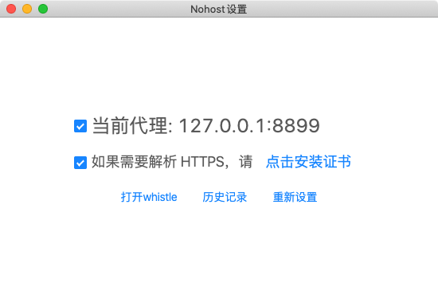

# nohost-client
nohost pc 客户端，主要用来设置用户电脑代理，将用户系统代理设置为nohost 客户端。

主界面如图所示：




# 项目目录结构

主要目录说明：
- app/assets: 客户端用到的图标
- app/lib: 公共代码

目录树状结构：
```
├─app 客户端代码
│  ├─assets 客户端用到的图标、静态资源
│  ├─index.html app界面
│  ├─main.js 管理app生命周期
│  └─package.json
```

项目核心是whistle提供代理抓包服务，客户端启动的时候会启用一个whistle服务。

# 开发

# 安装依赖
项目初始，需要在两处安装依赖

```sh
# 根目录
npm install
```
进入app目录下安装依赖
``` sh
npm install
```

# 本地调试

``` sh
npm run start
```


# 打包客户端
打包windows客户端

``` sh
npm run pack:win
```

打包生成的windows客户端在 dist/nohost-v0.0.1-win.exe

打包mac客户端

``` sh
npm run pack:mac
```

打包生成的mac客户端在 dist/nohost-v0.0.1-mac.dmg

打包生成的客户端即可提供给其他人安装使用。